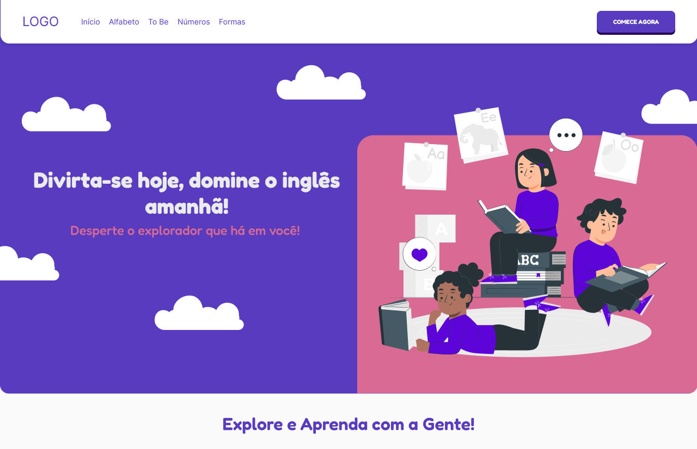
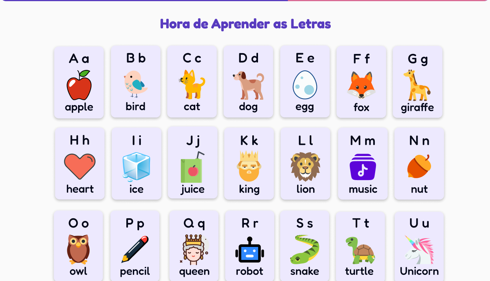
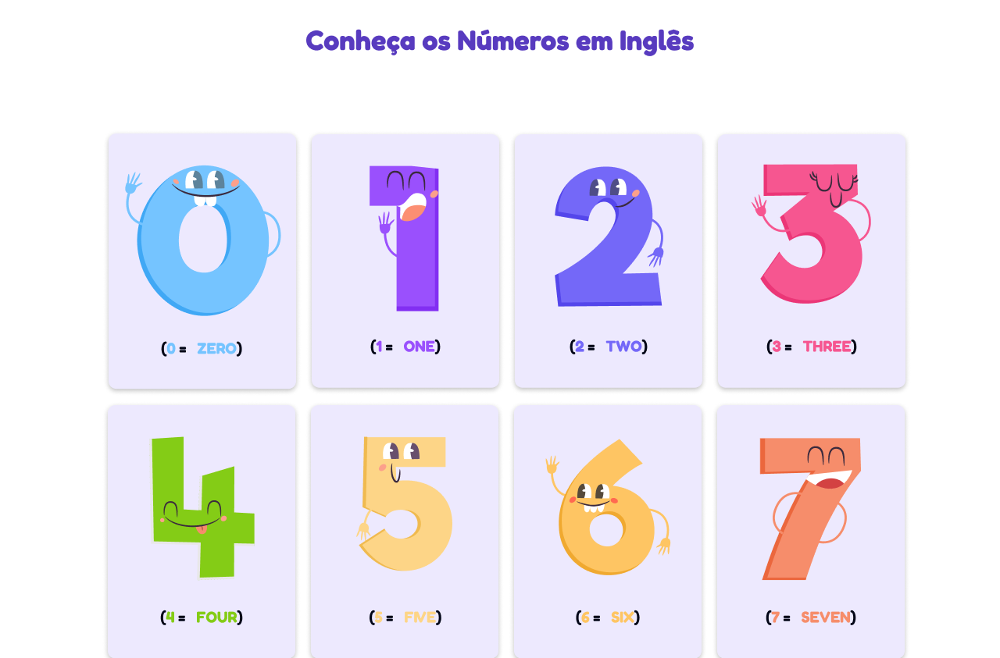
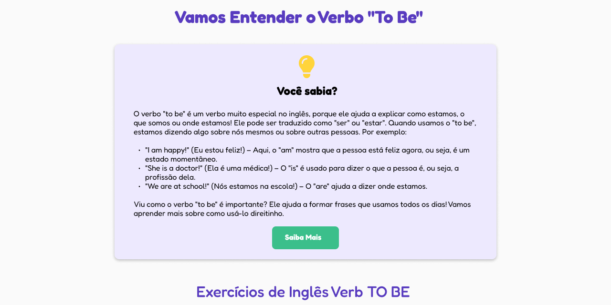

# kiddieLingo 📚🇺🇸✍🏻

 

</img>

<h3 align="center">Status: 🛠️ In development</h3>

  </img>
  </img>
  </img>

</img>

## 🌟📚 Sobre | About  
**PT-BR:**  
O **KiddieLingo** é uma plataforma educacional para o ensino de inglês voltada para crianças de baixa renda, criada como parte de um trabalho acadêmico de Atividade Extensionista. O projeto tem como foco proporcionar uma experiência de aprendizado acessível e inclusiva, alinhada aos ODS de **Educação de Qualidade** e **Redução das Desigualdades**.  

**EN:**  
**KiddieLingo** is an educational platform designed to teach English to low-income children. It was developed as part of an academic extension activity project, focusing on providing an accessible and inclusive learning experience aligned with the SDGs of **Quality Education** and **Reduced Inequalities**.

## 🎨👀 Project Preview

</img>

</img>

</img>

## Preview
- <a href="https://kiddie-lingo.vercel.app/" target="_blank">**Click Here** &#x1F517;</a>

## 👨‍💻 Author
This project was made with ❤️ by **Pedro.S.**